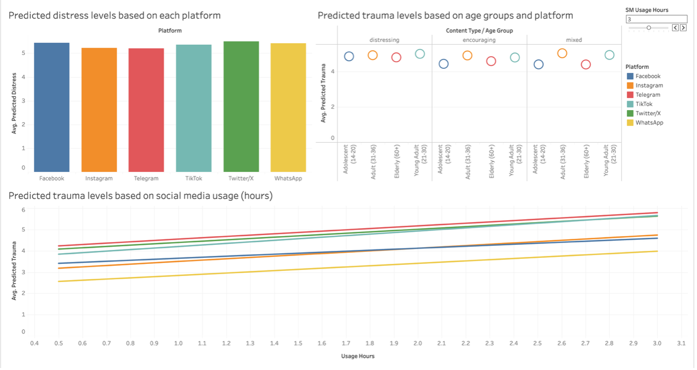
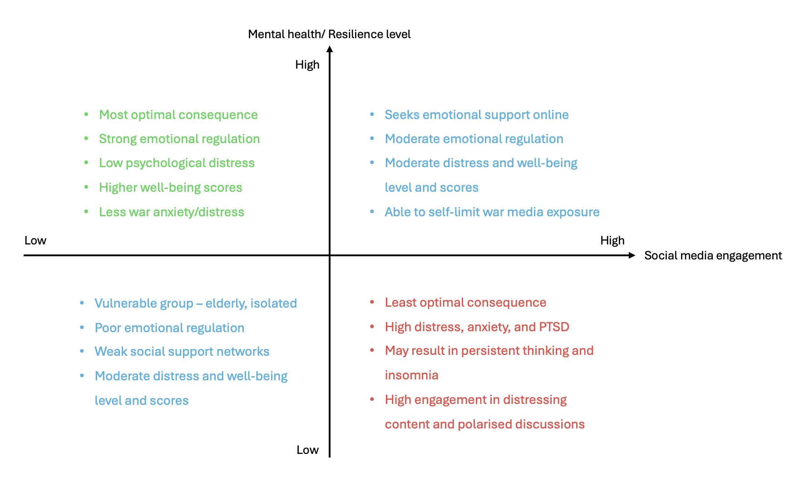

# Effects of social media on mental health in times of crisis

## Table of Contents
1. [🫧 Project Description](#project-description)
2. [🔗 Sources](#sources)
3. [🔍 Research Summary](#research-summary)
4. [🧩 STEEPLE Analysis](#steeple-analysis)
5. [🫆 Interactive Model and Results](#interactive-model-and-results)
6. [💻 Usage](#usage)
7. [💭 Future Recommendations](#future-recommendations)
8. [👤 Support Information](#support-information)

---

## 🫧 Project Description

The rapid advancement of technological tools and increasing usage of social media platforms have reshaped the way people communicate with each other, social perspectives, and coping mechanisms. This project investigates the extent to which social media negatively impacts the mental health of the general population during times of crisis, including wars and periods of economic instability. Through an extensive research of publicly available articles and datasets, this project examines how social media affects mental health and resilienece levels across different demographics such as young adults and the elderly, and how individuals are navigating an increasingly uncertain future shaped by both real-world conflict and its digital representation.

### To what extent does social media have a negative effect on mental health of the general population in times of crisis?

Ultimately, this project aims to develop predictive and interactive models that capture the complex relationship between social media use and mental health outcomes, contributing to a broader understanding of how advancement of technological tools can both challenge and support our society's resilience in times of crisis.

The project outline includes
- Identifying key variables that directly and indirectly influence coping behaviours and resilience levels
- Understanding the role of social media in social support
- Identifying the psychological consequences of war media exposure
- Identifying the interactions of different types of social media engagement on mental health
- Developing predictive and interactive models capturing the relationship between of social media use and mental health outcomes

---

## 🔗 Sources

A total of 5 papers and articles were used in the research, modelling, and visualisation process.

1. Feten Fekih-Romdhane, M. H. (2024, June). Mediating effect of depression and acute stress between exposure to Israel-Gaza war media coverage and insomnia: a multinational study from five arab countries. Retrieved from PubMed Central: https://pmc.ncbi.nlm.nih.gov/articles/PMC11151504/
2. Kübra Gülırmak Güler, E. A. (2024, October 28). Fronts in Minds: A Phenomenological Study on the Effects of War News on Collective Mental Health . Retrieved from Wiley Online Library: https://onlinelibrary-wiley-com.wwwproxy1.library.unsw.edu.au/doi/full/10.1111/phn.13458
3. Nawara Kirallah Abd El Fatah, A. M.-A. (2025, June 16). Unseen Battles: The Impact of War Media Exposure on Stress, Anxiety and Persistent Thinking Among Elderly Community Dwellers: A Cross-Sectional Study. Retrieved from Wiley Online Library: https://onlinelibrary-wiley-com.wwwproxy1.library.unsw.edu.au/doi/full/10.1111/inm.70082
4. Tali Gazit, S. E. (2025, November 6). From Screens to Scars: Understanding the Association Between Social Media Engagement and Trauma During Crises and Emergency Situations. Retrieved from Wiley Online LIbrary: https://onlinelibrary.wiley.com/doi/10.1002/smi.70115
5. Yael Malin, Y. G. (2026, July). Mental health during war: Social media use and protective factors among adolescents and young adults. Retrieved from ScienceDirect: https://www-sciencedirect-com.wwwproxy1.library.unsw.edu.au/science/article/pii/S0747563226000336

---

## 🔍 Research Summary

Across all five papers, it is concluded that social media only affects mental health and resilience of individuals to a moderate extent, as it is usually not the direct driver of distress and trauma during war times and crises. Independent variables such as screen time and media engagement volumes are correlated with increased distressed, anxiety, insomnia, and trauma regardless of demographic group. Dependent variables constantly shift with respect to population groups – distress and well-being for youths, stress and anxiety for the elderly, insomnia and future uncertainty for Arab and Turkish adults. There are also changing variables such as economic instabilities and pandemic aftershocks which affects psychological risks and resilience levels. Protective factors are consistent across the papers, which includes emotional regulation, perceived social support, media literacy, and access to reliable information sources. Most importantly, it is important that while technology tools are convenient and accessible, they cannot fully replace in-person social support as a resilience resource during prolonged crisis.

### Independent Variables

- Social media usage frequency
- Type of social media engagement (graphic violence, war footage, political discussions, etc.)
- Emotion regulation capacity
- Perceived social support
- Direct war exposure

### Dependent Variables

- Psychological distress (depression, anxiety, etc.)
- Trauma symptoms (avoidance, persistent thinking, etc.)
- Insomnia severity
- Resilience level

---

## 🧩 STEEPLE Analysis

| **STEEPLE** | **Description** |
|------------|----------------------------------|
| `Social` | Social media platforms such as Twitter, Instagram, TikTok, etc. and online debates can trigger both positive and negative emotions such as distress, anxiety, o mood boosts |
| `Technological` | Personalised algorithm feeds and unfiltered content may increase the exposure of distressing/encouraging images and videos – how unfiltered/filtered/biased are these content? |
| `Economic` | Socioeconomic status may affect the access of social media and resilience resources, and economic instabilities further drives anxiety and future uncertainties of the global economy |
| `Environmental` | Geographic proximity to missile strikes and war zones are significant drivers, but war media exposure can also cause distress for individuals not living in war regions |
| `Political` | Polarised war posts on platforms such as Reddit or Twitter may include online political debates and spreading of misinformation, resulting in further social polarisation |
| `Legal/Ethical` | Interference of war media exposure and media literacies by governments (health and education ministries) is necessary to regularise screen time, fake news, and negative content |

---

## 🫆 Interactive Model and Results

The interactive model is a combination of 3 visualisations that predicts the average distress and trauma levels based on several factors such as social media platform, usage in hours, age group, and content type. The slider on the top left corner is an interactive feature that allows the user to slide from a minimum of 1 hour, to a maximum of 5 hours of time spent on social media platforms. The visualisations are also customisable with other variables such as prediction depression or insomnia, war media exposure hours, and coping levels based on the user’s needs.

  
   
  <em>Interactive Tableau dashboard with predicted distress and trauma levels</em>

Across all platforms (Facebook, Instagram, Telegram, TikTok, Twitter/X, WhatsApp), the predicted distress levels were between 5.1 to 5.4 (on a scale of 10), which indicates low variance.  This suggests that the social media platform itself does not have a huge significance on distress or trauma levels. It is rather the amount of time spent on social media itself that is overall affecting the mental health of an individual. 

One of the most significant results was the relationship between usage hours and predicted trauma levels. It is noted that e**very additional hour of social media usage increases trauma and decreases mental health**. While all platforms show an upward trend based on the usage time, there is a steeper increase for Twitter/X and TikTok, and a lower increase for WhatsApp. This implies that social media platforms with video-based or real-time content results in higher trauma levels. 

However, **the predicted trauma levels vary slightly across age groups**, with young adults (24 to 30 years old) predicted to have the highest trauma level (5.2 to 5.5) and the elderly (60 years old and above) predicted to have a slightly lower trauma level (4.5 to 5.0). From the research summary, the media exposure time and engagement patterns are the key factors that drive these differences. Hence, age was not a significant predictor to distress and trauma levels.

Overall, the model and visualisations suggest that **social media has a significant negative impact on the mental health** of the general population in times of crisis. The most significant variable was the **amount of time spent on social media and exposure to war content**. Although other variables such as gender and age were explored, these variables were not as significant but still played a moderate role in the predicted distress and trauma levels. This suggests that social media as a whole plays a crucial role in shaping psychological outcomes, with platforms such as Twitter/X and TikTok sitting slightly higher due to their higher polarisation risk and video-based content.

  
   
  <em>Interactive relationship between social media engagement time and mental health/resilience levels</em>

---

## 💭 Future Recommendations

Keeping the STEEPLE analysis in consideration, the technological and ethical factors can be further explored in the future to ensure the safety of social media use and build more resilience support systems, leveraging artificial intelligence in personalised resources and scalable systems across affected populations.

1. **Technological factor** - Social media platforms should have stricter enforcements on AI-driven detection of distressing or misleading content, and provide user controls such as content filters, screen-time reminders, and warning labels for sensitive media. Although these features may already exist, they may not be strongly enforced especially in countries that are directly affected by war. These platforms could directly block out content that may contain heavy violence or politically biased discussions to reduce psychological distress and polarising opinions.

2. **Ethical factor** - Governments and organisations can also step in to strengthen the nation’s digital literacy and mental health education, particularly for young adults and the elderly. This includes teaching users how to critically evaluate the type of content they are engaging with, and effective ways to manage screen time.

Overall, these measures are crucial to reducing mental health risks and preventing lower resilience levels in an uncertain future.

---

## 💻 Usage

Download the Tableau workbook that contains the final interactive model and launch it on either Tableau Public or the software itself.

### Navigating the Workbook

The dashboard should be the main view that shows all 3 charts simultaneously. This is the recommended starting point for exploring the data. Alternatively, click any individual sheet tab at the bottom to focus on one chart at a time. The variables and visualisation types can be switched by dragging and dropping from the left panel.

- Sheet 1: Predicted distress levels by platform
- Sheet 2: Predicted trauma by content type and age group
- Sheet 3: Predicted trauma across social media usage hours

### Using the Slider (SM Usage Hours)

This slider on the top right controls how many hours of daily social media usage are included in the view. It ranges from a minimum of 1 hour to a maximum of 5 hours.

- Drag the slider **left** to see predicted outcomes for low usage users
- Drag the slider **right** to see predicted outcomes for high usage users
- All three charts should simultaneously update as the slider is moved, demonstrating the relationship between social media usage and predicted distress/trauma levels across all platforms

### Exploring the Charts

- Sheet 1: Hover over any bar to see the exact predicted distress score for that platform
- Sheet 2: Compare circle sizes across the 3 content type columns (distressing, encouraging, mixed) and across age groups
- Sheet 3: Steeper lines indicate platforms where additional usage has a stronger impact on trauma levels

### Interpreting the Scores

All predicted scores are on a 0 to 10 scale, which is synthesised from the 5 sources.

- 0 to 3: Low risk
- 3 to 6: Moderate risk
- 6 to 10: High risk

---

## 👤 Support Information

If you have any questions or suggestions regarding the project, feel free to contact Yu Tyan through yutyanng@gmail.com.
